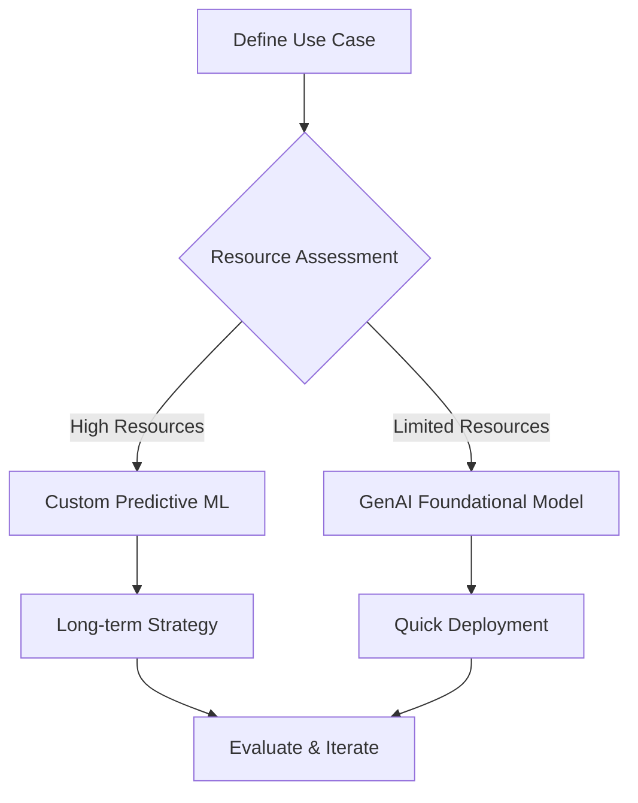
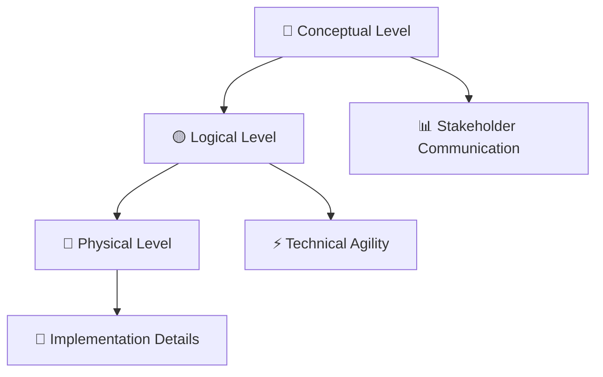
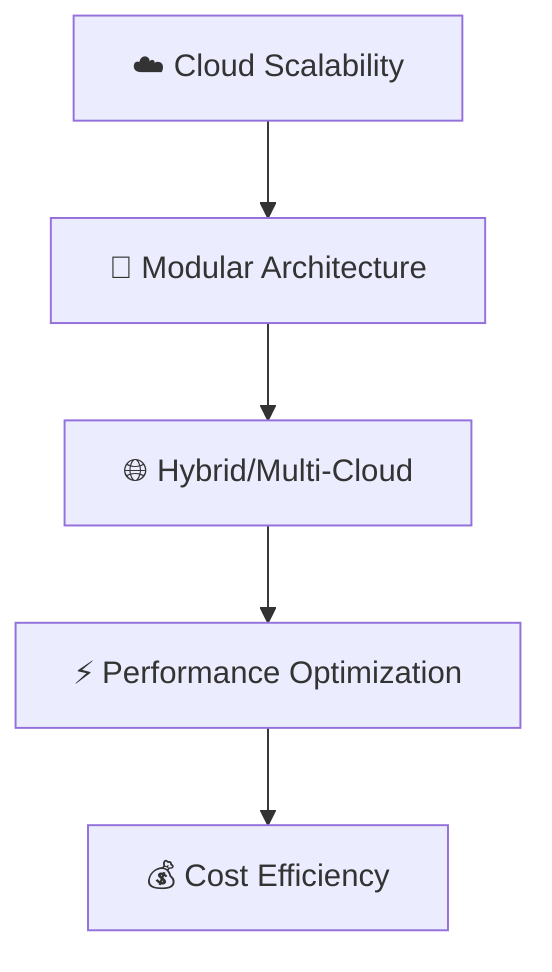
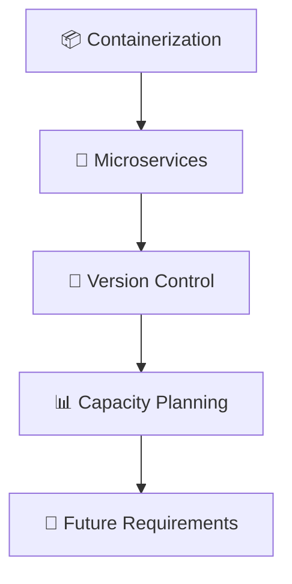
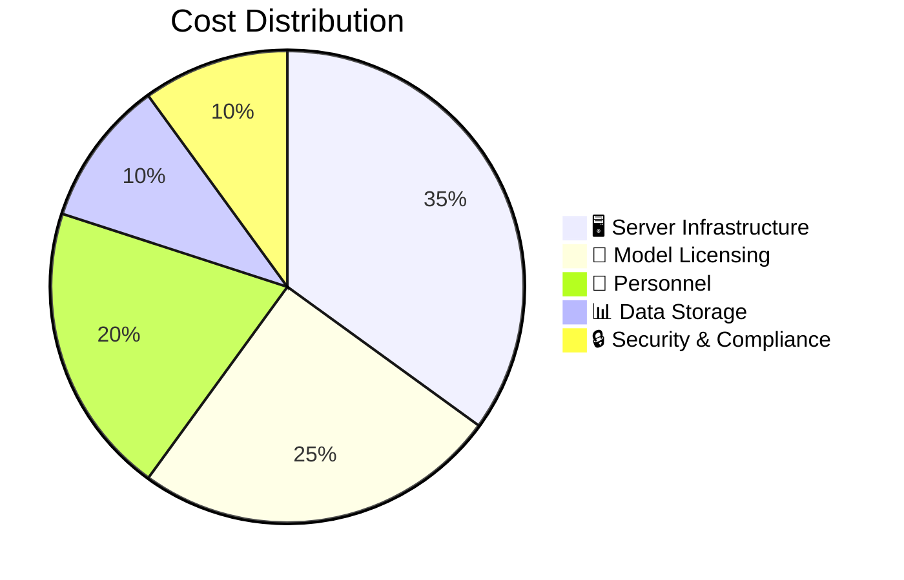
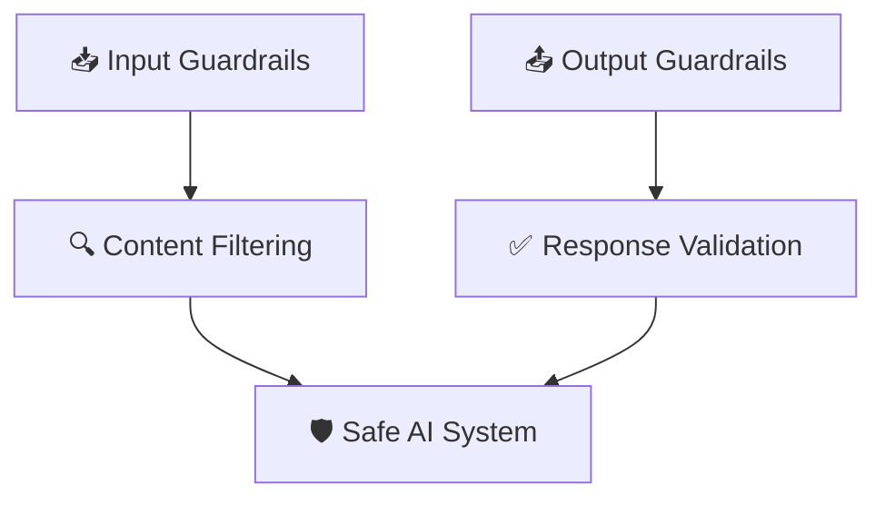
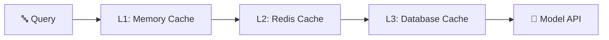
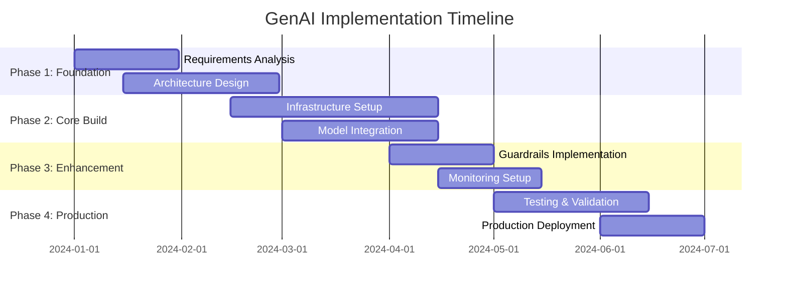

# Gen AI Architecting

[https://youtu.be/94ESD5pP1oE?si=NJ4T-sRod_ZM3H8f](https://www.youtube.com/live/_r1X380nEKg?si=MKVMHtHjwTeJ0P7a)

# 🤖 Predictive ML vs GenAI: Strategic Decision Framework

## 📊 Overview
A comprehensive comparison between **Custom Predictive ML** and **GenAI Foundational Models** to guide technology selection for different use cases and organizational needs.

---

## 🔍 Detailed Comparison Matrix

### 📈 **Resource & Investment Factors**

| Criterion | Custom Predictive ML | GenAI Foundational Model |
|-----------|----------------------|--------------------------|
| **Model Size** 📏 | ⭐ Small/Medium | ⭐⭐⭐⭐⭐ Very Large |
| **Training Investment** 💰 | ⭐⭐⭐⭐⭐ Very High | ✅ Done by model owner |
| **Inference Cost** 💸 | ⭐ Low | ⭐⭐⭐ High |
| **Initial Investment** 🚀 | ⭐⭐⭐⭐⭐ Very High | ⭐ Low |

### 🎯 **Requirements & Expertise**

| Criterion | Custom Predictive ML | GenAI Foundational Model |
|-----------|----------------------|--------------------------|
| **Data Availability** 📊 | ✅ Required | ❌ Not Required |
| **Expertise** 🧠 | ✅ Required | ❌ Not Required |

### ⚙️ **Operational Characteristics**

| Criterion | Custom Predictive ML | GenAI Foundational Model |
|-----------|----------------------|--------------------------|
| **Model Control** 🎛️ | ⭐⭐⭐⭐⭐ Full Control | ⭐ Limited Control |
| **Deterministic Behavior** 🎯 | ✅ More Deterministic | ⚠️ Less Deterministic |
| **High Compliance** 📋 | ⭐ Some Support | ❌ Limited Support |

### 📅 **Strategic Fit**

| Criterion | Custom Predictive ML | GenAI Foundational Model |
|-----------|----------------------|--------------------------|
| **Project Length** ⏰ | 🎯 Long-term investments | 🚀 Quick deployment |
| **Workload Size** 📊 | 🎯 Large workloads | 💡 Variable workloads |

---

## 🎯 Decision Framework

### 🟢 **Choose Custom Predictive ML When:**
- **Long-term strategic investment** with dedicated resources
- **Large-scale workloads** requiring optimized performance  
- **High compliance requirements** and regulatory constraints
- **Deterministic outcomes** are critical for business operations
- **Full model control** is essential for competitive advantage
- **Abundant training data** and ML expertise available

### 🔵 **Choose GenAI Foundational Model When:**
- **Quick time-to-market** is prioritized
- **Limited ML expertise** or resources available
- **Minimal upfront investment** required
- **Flexibility** for diverse use cases needed
- **No specific training data** requirements
- **Prototype or proof-of-concept** development

---

## 💡 **Key Takeaways**

> **Strategic Principle**: The choice between Custom Predictive ML and GenAI depends on your organization's **resource availability**, **compliance requirements**, and **long-term strategic goals**.

### 🔄 **Hybrid Approach Considerations**
Many organizations benefit from a **portfolio approach**:
- Use **GenAI** for rapid prototyping and general tasks
- Develop **Custom ML** for core business differentiators
- Evaluate **ROI and strategic value** for each use case

---

## 📚 **Implementation Roadmap**

### 🎯 **Success Metrics**
- **Performance**: Accuracy, latency, throughput
- **Cost**: Total cost of ownership over project lifecycle  
- **Compliance**: Regulatory adherence and auditability
- **Scalability**: Ability to handle growing workloads
- **Maintainability**: Long-term operational sustainability

# 🤖 Architecting GenAI - Comprehensive Notes

## 📊 Overview
**Difficulty Level:** 🟢 Level 100  
**Resource:** [Lucid Chart Architecture Link](https://lucidchart.com)

---

## 🎯 Business Goal

> **Mission:** Create architectural diagrams as teaching aids to help stakeholders understand key components of GenAI workloads, visualize technical paths, and address technical uncertainty when adopting GenAI.

### 🎓 Learning Objectives
- 📍 Guide stakeholders through technical landscape
- 🚫 Avoid prescriptive solutions
- 💬 Foster informed infrastructure discussions
- 🔗 Understand integration patterns & system dependencies

### 📚 Reference Frameworks
| Framework | Purpose | Link |
|-----------|---------|------|
| 🏗️ TOGAF | Enterprise Architecture | [OpenGroup TOGAF](https://www.opengroup.org/togaf) |
| 🎨 C4 Model | Software Architecture | [C4Model.com](https://c4model.com/) |
| 🔄 Design Levels | Conceptual → Logical → Physical | [Medium Article](https://medium.com/@nolomokgosi/conceptual-logical-and-physical-design-c24100846931) |

---

## 🏗️ Technical Considerations

### 📐 Three Levels of Diagramming

| Level | 🎯 Purpose | 👥 Audience | 📝 Details |
|-------|------------|-------------|-------------|
| **🔵 Conceptual** | High-level business solution communication | Key stakeholders | Business-focused overview |
| **🟡 Logical** | Key technical components without detailed parameters | Technical teams | Quick rearchitecting capability |
| **🔴 Physical** | Complete implementation details | Engineers/Developers | ARNs, IP addresses, all parameters |

---

## 🏛️ Architectural & Design Considerations

### 📋 Requirements, Risks, Assumptions & Constraints (RRAC)

#### ✅ Requirements
| Category | Description | Examples |
|----------|-------------|----------|
| 🏢 **Business** | Goals and objectives | ROI targets, user adoption |
| ⚙️ **Functional** | System capabilities | Text generation, image analysis |
| 🚀 **Non-functional** | Performance criteria | Latency, scalability, security |
| 🛠️ **Tooling** | Technology decisions | GenAI vs Traditional ML |

#### ⚠️ Risks
> Potential events that could negatively impact architecture success
- 📈 Model performance degradation
- 💰 Cost overruns
- 🔒 Security vulnerabilities
- 🔄 Integration failures

#### 🤔 Assumptions
> Truths considered without proof during planning
- 📊 Data availability and quality
- 🔧 Technical team capabilities
- 💵 Budget allocations
- ⏰ Timeline feasibility

#### 🚧 Constraints
> Non-negotiable limitations and restrictions
- 💰 Budget limits
- 🏛️ Regulatory requirements
- 🏗️ Legacy system dependencies
- ⏱️ Timeline restrictions

---

## 📊 Data Strategy

### 🎯 Core Components

| Component | Key Considerations |
|-----------|-------------------|
| 📥 **Collection** | Sources, volume, frequency |
| 🧹 **Preparation** | Cleaning, transformation, labeling |
| ✅ **Quality** | Accuracy, completeness, bias detection |
| 🔒 **Security** | Encryption, access controls, compliance |
| 🔗 **Integration** | API design, data pipelines |

---

## 🤖 Model Selection & Development

### 🎯 Key Decision Factors

#### 🏠 Hosting Options
| Option | ✅ Pros | ❌ Cons |
|--------|---------|---------|
| 🌐 **SaaS** | Quick setup, managed infrastructure | Vendor lock-in, less control |
| 🏠 **Self-Hosted** | Full control, customization | Infrastructure overhead, expertise needed |

#### 📖 Model Types
| Type | Description | Use Cases |
|------|-------------|-----------|
| 🔓 **Open Source** | Fully accessible code | Custom modifications, transparency |
| ⚖️ **Open Weight** | Weights available, limited code | Research, fine-tuning |
| 🔒 **Proprietary** | Closed source | Production stability, support |

#### 📊 Technical Specifications
- 🔤 **Input-Output Modalities:** Text-to-text, multimodal
- 🔢 **Model Count:** Single vs. ensemble approaches
- 📞 **API Calls:** Expected volume and frequency
- 📏 **Model Size:** Parameter count, memory requirements
- 🧪 **Evaluation Metrics:** Accuracy, latency, cost
- 📝 **Context Window:** Input/output token limits
- 🎯 **Fine-tuning:** Custom training requirements

---

## 🏗️ Infrastructure Design

### 🎯 Design Principles

| Principle | Implementation | Benefits |
|-----------|----------------|----------|
| ☁️ **Scalability** | Auto-scaling groups, serverless | Handle variable workloads |
| 🧩 **Modularity** | Microservices, containers | Easy updates, component replacement |
| 🌐 **Multi-Cloud** | Vendor diversity | Avoid lock-in, optimize costs |
| 🔧 **Specialized Hardware** | GPUs, TPUs | AI workload optimization |

---

## 🔗 Integration & Deployment

### 🚀 Deployment Strategy
| Component | Technology | Purpose |
|-----------|------------|---------|
| 🔌 **APIs** | REST, GraphQL | System integration |
| 🔄 **CI/CD** | Jenkins, GitLab | Automated deployment |
| 🏛️ **Legacy Compatibility** | Adapters, middleware | Seamless transition |
| 📦 **Containerization** | Docker, Kubernetes | Portability, scaling |

---

## 📊 Monitoring & Optimization

### 📈 Monitoring Framework

#### 🎯 Key Metrics
| Metric Type | Examples | Purpose |
|-------------|----------|---------|
| 📊 **Performance** | Latency, throughput | System health |
| 💰 **Cost** | Token usage, compute costs | Budget management |
| 🎯 **Business** | User satisfaction, adoption | ROI measurement |
| 🔒 **Security** | Access attempts, anomalies | Risk mitigation |

---

## 🛡️ Governance & Security

### 🔒 Security Framework
| Layer | Controls | Implementation |
|-------|----------|----------------|
| 🔐 **Access** | RBAC, MFA | Identity management |
| 📊 **Data** | Encryption, anonymization | Privacy protection |
| ⚖️ **Compliance** | GDPR, HIPAA | Regulatory adherence |
| 🤖 **AI Ethics** | Bias detection, fairness | Responsible AI |

---

## 📈 Scalability & Future-Proofing

### 🚀 Scalability Strategies

---

## 💼 Business Considerations

### 🎯 Use Case Definition
> **Critical First Step:** Clearly define specific GenAI use cases within your organization

#### 📋 Key Questions
- ❓ What business problems are we solving?
- 🎯 What are the desired outcomes?
- 📊 How will we measure success?

### 🔍 Complexity Assessment

#### 🧩 Integration Complexity
| Factor | Questions | Impact |
|--------|-----------|--------|
| 🔧 **Moving Parts** | How many components will be added? | System complexity |
| 👥 **Maintenance** | Set-and-forget vs. regular monitoring? | Operational overhead |
| 🔗 **Dependencies** | How many system integrations? | Risk of failure |

### 💰 Cost Levers

#### 💵 Primary Cost Drivers

| Cost Driver | Factors | Optimization |
|-------------|---------|--------------|
| 🖥️ **Servers** | CPU, GPU, memory | Right-sizing, auto-scaling |
| 🤖 **Models** | Size, calls, licensing | Efficient model selection |
| 📊 **Data** | Storage, transfer, processing | Compression, caching |
| 👥 **Personnel** | Engineers, operations | Automation, training |

### 🔓 Vendor Lock-in Avoidance

#### 🛡️ Anti-Lock-in Strategies
| Strategy | Implementation | Benefits |
|----------|----------------|----------|
| 🔌 **Abstraction Layer** | Model API wrappers | Easy provider switching |
| 📊 **Standard Formats** | ONNX, common APIs | Portability |
| 🏗️ **Multi-vendor** | Hybrid approaches | Negotiation power |
| 📝 **Open Standards** | Open-source tools | Community support |

---

## 🚨 Essential Production Components

### 🛡️ Critical Requirements
| Component | Purpose | Implementation |
|-----------|---------|----------------|
| 🛡️ **Guardrails** | Safety controls | Input/output filtering |
| 🧪 **Evaluations** | Quality assurance | Automated testing |
| 📦 **Sandboxing** | Isolation | Container security |

---

## 🤖 LLM-Specific Considerations

### 1️⃣ Model Selection Framework

#### 🎯 Selection Criteria

| Criterion | Options | Considerations |
|-----------|---------|----------------|
| 🔤 **Modalities** | Text, image, audio, video | Use case requirements |
| 🔓 **Licensing** | Open source vs. proprietary | Legal, customization |
| 🏠 **Hosting** | SaaS vs. self-hosted | Control, cost, expertise |
| 📝 **Context** | Token limits | Document size handling |
| 💰 **Cost** | Per token, subscription | Budget alignment |

### 2️⃣ Context Enhancement

#### 📊 Context Strategy Decision Matrix
| Use Case | Solution | Criteria |
|----------|----------|----------|
| 📄 **Single Document** | Direct injection | Small size, one-time use |
| 📚 **Multiple Documents** | Knowledge base | Large corpus, repeated access |
| 🔄 **Dynamic Content** | Real-time retrieval | Changing information |

#### 🎯 Evaluation Criteria
- 📏 **Input Size:** Single document vs. document chunks
- 📝 **Context Window:** Model token limitations
- 🔄 **Usage Pattern:** One-time vs. repeated access
- 📈 **Scale:** Prototype vs. production system

### 3️⃣ Guardrails Implementation

#### 🛡️ Guardrail Types

| Type | Function | Examples |
|------|----------|----------|
| 📥 **Input** | Filter harmful content | PII detection, prompt injection |
| 📤 **Output** | Validate responses | Factual accuracy, bias checking |
| 🔧 **Implementation** | Technical approach | API layers, model fine-tuning |

### 4️⃣ Model Access Abstraction

#### 🔌 Abstraction Benefits
- 🔄 **Multi-model Support:** Switch between providers
- 🎨 **Multi-modal:** Handle different input types
- 📊 **Standardization:** Consistent API interface
- 🔧 **Flexibility:** Easy model upgrades

### 5️⃣ Caching Strategy

#### 📊 Cache Architecture

| Cache Level | Technology | Use Case | TTL |
|-------------|------------|----------|-----|
| 🚀 **L1: Memory** | In-app cache | Frequent queries | Minutes |
| ⚡ **L2: Distributed** | Redis, Memcached | Shared responses | Hours |
| 💾 **L3: Persistent** | Database | Long-term storage | Days |

#### 🎯 Optimization Factors
- 🎯 **Hit Rate:** Maximize cache effectiveness
- 🔄 **Invalidation:** Update stale content
- 💾 **Storage:** Cost vs. performance balance
- 📊 **Analytics:** Monitor usage patterns

### 6️⃣ Agent Architecture

#### 🤖 Agent Components
| Component | Function | Integration |
|-----------|----------|-------------|
| 🎯 **Actions** | Executable tasks | API endpoints, tools |
| 🔗 **System Integration** | External connections | Databases, services |
| 🧠 **Decision Logic** | Action selection | Reasoning, planning |
| 🔄 **Feedback Loop** | Learning mechanism | Performance optimization |

---

## 📈 Implementation Roadmap

### 🚀 Phase-based Approach

---

## ✅ Success Metrics & KPIs

| Category | Metrics | Target |
|----------|---------|--------|
| 📊 **Technical** | Latency, uptime, accuracy | < 2s, 99.9%, > 95% |
| 💰 **Financial** | Cost per query, ROI | Budget compliance, positive ROI |
| 👥 **User** | Adoption rate, satisfaction | > 80% adoption, > 4.5/5 rating |
| 🔒 **Security** | Incident count, compliance | Zero breaches, 100% compliance |

---

*📝 This comprehensive guide provides a structured approach to GenAI architecture, balancing technical depth with business considerations for successful implementation.*

