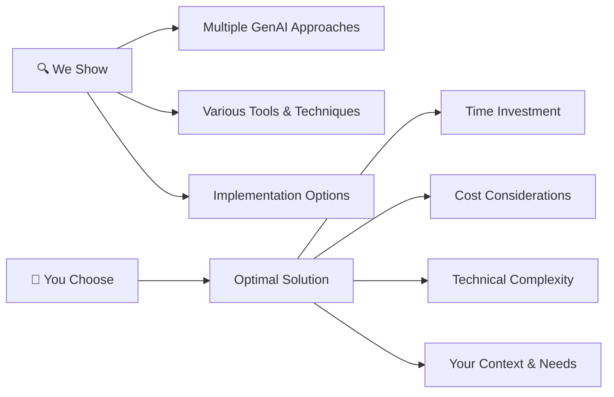

# 🚀 GenAI Bootcamp
*6-Week Project-Based Learning Experience*

---

## 📚 Resources & Links

| Type | Link | Description |
|------|------|-------------|
| 🌐 **Bootcamp Portal** | [genai.cloudprojectbootcamp.com](https://genai.cloudprojectbootcamp.com/booth/freecodecamp) | Main registration and course platform |
| 🎥 **Full Details Video** | [YouTube - Details](https://youtu.be/DOXJ7s1D6iE?si=wIPex3ivhBByP5v_) | Complete bootcamp overview |
| 🎬 **Additional Video** | [YouTube - Build Demo](https://youtu.be/nJ25yl34Uqw?si=VRuN4yQe0hI22U09) | Building demonstration |

---

## 🎯 What is the FREE GenAI Bootcamp?

### 📋 Program Overview
| Feature | Details |
|---------|---------|
| ⏱️ **Duration** | 6 Weeks of Project-Based Learning |
| 📅 **Schedule** | Every Saturday Noon EST |
| 📝 **Homework** | Yes - Required assignments |
| 📊 **Grading** | Performance evaluation included |
| 🏆 **Digital Badges** | Achievement recognition system |
| 💰 **Cost** | 100% FREE |
| 🔐 **Account** | Bring-Your-Own-Account (BYOA) |

---

## 🏗️ What Are We Building?

### 🎭 Your Role
> **AI Engineer for a Language Learning School**
> 
> *Mission: Augment the learning experience for students taking instructor-led classes*

### 🛠️ Project Deliverables

#### 1. 🌐 **Web Application Enhancement**
- Integrate GenAI functionality into existing platform
- Enhance user experience with AI-powered features

#### 2. 📚 **Learning Activity Projects**
- Develop series of AI-driven learning activities
- Create interactive student engagement tools

#### 3. 🚀 **Production Readiness**
- Prepare company for production-level GenAI offerings
- Implement best practices and scalability considerations

### 🌍 Language Focus
| Instructor | Language | Your Choice |
|------------|----------|-------------|
| 🧑‍🏫 **Andrew** | 🇯🇵 Japanese | 🌐 Any language you prefer |

---

## 🌉 Building The Bridge As We Cross It

### ⚠️ **Expect the Unexpected**

> 🎪 **Real-World Project Simulation**
> 
> Just like actual development projects, this bootcamp embraces change and uncertainty!

#### 📺 **Live-Stream Realities**
- 🔄 May end incomplete - follow-up videos will complete content
- ⚡ Last-minute emerging technology integration (e.g., DeepSeek)
- 🎲 Guest instructor changes and surprise appearances
- 📈 Scope evolution throughout the program

#### 🎯 **Success Metrics**
| What Doesn't Matter | What Matters |
|---------------------|--------------|
| ❌ Perfect completion | ✅ Domain knowledge growth |
| ❌ Zero failures | ✅ Technical certainty through experience |

---

## 📋 Proof of Effort Checklist

### ✅ **Forum Participation Requirements**

| Criteria | Description | Status |
|----------|-------------|--------|
| 📍 **Correct Forum** | Post in the appropriate week's forum | □ |
| 🔍 **Detailed Descriptions** | Explain issues thoroughly, not just "it doesn't work" | □ |
| 💻 **Code Samples** | Provide relevant code examples | □ |
| 📝 **Markdown Format** | Use proper markdown formatting | □ |
| 🎨 **Syntax Highlighting** | Apply appropriate code highlighting | □ |
| 🛠️ **Resolution Steps** | Show attempted solutions and their outcomes | □ |
| 📸 **Quality Screenshots** | Computer screenshots (not phone photos) | □ |
| 📊 **Key Information** | Include URL, Network Tab, Error Console, System info | □ |

### 🚫 **Insufficient Information Example**
> ❌ "I got a 500 error"
> 
> ✅ Provide context, error details, and troubleshooting attempts

---

## 🎪 We Show, You Choose

### 🔬 **Our Approach**

### 💡 **Key Considerations**

#### ✅ **Universal Truths**
- 🛣️ **No "wrong way"** - If it works for you, it works
- 🌱 **Immature market** - GenAI is still evolving
- 🎓 **No experts yet** - We're all learning together
- 👑 **Except for Rola** - Our resident expert!

#### 🎛️ **Decision Factors**
| Factor | Considerations |
|--------|----------------|
| ⏰ **Time** | Available hours for implementation |
| 💰 **Cost** | API fees, infrastructure expenses |
| 🔧 **Complexity** | Technical difficulty level |
| 🎯 **Context** | Your specific requirements |

---

## ❓ Fast FAQs

<strong>🤔 I didn't finish the prerequisites, will I be able to keep up?</strong>

> **📚 Prerequisites are optional but helpful**
> 
> The prerequisites aren't hard requirements - they're designed to expose you to relevant terms and tools. Use them as reference material if you need to catch up during the bootcamp.

<strong>⏰ What happens if I join late? Can I still participate?</strong>

> **🏃‍♂️ Late joiners welcome**
> 
> Focus on submitting grading assignments on time. There's always opportunity to catch up on previous content.

<strong>😰 This is too hard, should I quit?</strong>

> **🎯 Multiple learning paths available**
> 
> If the pace feels overwhelming:
> - Do what you can with the main content
> - Focus on GenAI Essentials
> - Audit the bootcamp for exposure without pressure

<strong>💬 How do I get into the Discord?</strong>

> **🔐 Registration required**
> 
> - You must be registered for the bootcamp
> - Discord link generates in the ExamPro platform
> - Having issues? Contact ExamPro support: **support@exampro.co**

---

## 🎉 Ready to Start Your GenAI Journey?

🔗 **[Register Now](https://genai.cloudprojectbootcamp.com/booth/freecodecamp)**

---

*💫 Transform your understanding of GenAI through hands-on, project-based learning!*
